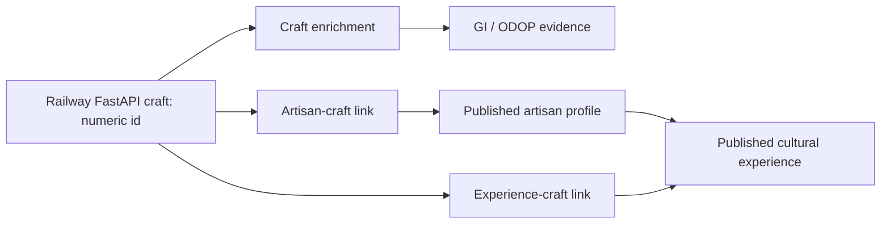

# Virāsat Phase 2 Architecture Proposal

**Status:** Read-only proposal for approval. No FastAPI, database, UI, routing, visual-system, or Phase 1 service behavior has been changed.

> **Phase 1 protection:** Checkpoint `24a4d99c` preserves the verified live integration before Phase 2. The deployed Railway API remains the sole source of route discovery and core craft records; its 65 records, numeric craft lookup, CORS behavior, route planner, Explore catalogue, craft detail fetch, and fallback paths are not to be altered by this work.

## 1. Decision in brief

The smallest safe way to make the journey **Traveller → Route → Craft → Authenticity → Artisan → Cultural Experience** real is an **enrichment overlay**, keyed by the existing numeric FastAPI craft ID. The Railway service continues to own route geometry and core craft facts. Phase 2 owns only the additional, curated context that the Railway schema does not contain: GI/ODOP provenance, maker profiles, and non-bookable cultural-experience listings.

| Design choice | Recommendation | Reason |
|---|---|---|
| Core craft source | Keep Railway FastAPI unchanged | The live `/crafts`, numeric lookup, and route-discovery contracts are working and must remain stable. [1] |
| Link key | Use the FastAPI numeric `craft.id`, represented in the UI as `api-{id}` | It is the only stable, source-owned identifier already used by the Phase 1 services. |
| Phase 2 data ownership | Frontend-owned, versioned enrichment manifest for the first release | It is the least invasive option and needs no Railway change, CORS change, migration, or new runtime dependency. |
| Future persistence path | Optional Manus-managed MySQL + public read-only tRPC layer | Use this only when the content needs editorial updates without a frontend release or the dataset grows beyond the first curated set. |
| Authenticity semantics | Use status plus evidence, not a bare boolean | A missing source must never be rendered as a GI/ODOP claim. |
| Experiences | Read-only discovery listings only | Prices, availability, reservations, payments, carts, and booking operations are expressly out of scope. |

## 2. Verified architecture baseline

The **live FastAPI OpenAPI document** exposes only health checks, `GET /crafts`, `GET /crafts/id/{craft_id}`, `GET /crafts/{region}`, and `POST /trip/crafts-along-route`; its `Craft` model has no GI, ODOP, artisan, or experience field. [1] The collaborator-owned schema confirms this: there is one `crafts` table with identity, category, location, description, coordinates, image URL, and timestamps—without any Phase 2 columns or relation tables. [2]

The current frontend already has the correct Phase 1 boundary. `craftService.ts` normalizes each live row to `id: api-{id}`, while `routeService.ts` normalizes route matches the same way and preserves the existing local fallback. `CraftDetail.tsx` fetches a live craft by numeric ID but then uses a Channapatna-only mock maker and experience route; other live crafts lead safely back to the planner. This is the precise insertion point: Phase 2 should **overlay** supplementary content after the live craft resolves, never replace the FastAPI request.

| Surface | Existing source of truth | Current gap | Phase 2 effect |
|---|---|---|---|
| Route Planner | Railway `/trip/crafts-along-route` | No authenticity or maker context | Add optional badges/kickers from a separate enrichment map after the live response is normalized. |
| Explore | Railway `GET /crafts`, mock fallback | GI/ODOP filters cannot distinguish unknown from verified data | Apply only verified overlay flags; keep unverified rows neutral and visible. |
| Craft detail | Railway numeric lookup, local fallback | Static Channapatna maker/experience exception | Render linked profiles and experiences only where enrichment is published. |
| Artisan profile | Hard-coded Lakshmi mock page | No parameterized profile lookup | Use a stable artisan slug when a profile is available; retain the present mock route for mock/fallback journeys. |
| Experience detail | Hard-coded Channapatna workshop and local demo reservation | No parameterized public experience | Use an experience slug for published read-only detail; do not add booking behavior. |

## 3. Options considered

### Option 1 — Versioned frontend enrichment overlay (**recommended for the first Phase 2 release**)

Create a typed, reviewable `heritageEnrichment` data module and an `enrichmentService` that joins content to live crafts by their numeric FastAPI ID. The module is a **curated content source**, not a replacement craft catalogue: it contains only evidence-backed GI/ODOP records and published maker/experience links. It returns no record when content is not ready.

This option changes no Railway schema or endpoint, leaves the 65-record catalogue untouched, and makes a failed enrichment lookup non-fatal. It is therefore the lowest-risk way to strengthen the core journey while preserving live and fallback Phase 1 behavior.

| Advantage | Trade-off |
|---|---|
| No migration, new backend API, CORS work, or FastAPI modification | Content changes require a frontend release. |
| Works with the existing offline/fallback demo | It is inappropriate once non-technical editorial workflows or a large contributor roster are needed. |
| Gives the reviewer an explicit provenance diff in source control | It needs a disciplined reviewed seed file rather than ad hoc edits. |

### Option 2 — Manus MySQL enrichment tables with public read-only tRPC procedures

This option keeps Railway unchanged while adding normalized content tables to the existing Manus-managed database. The web application’s same-origin tRPC layer would serve Phase 2 enrichment. It is the right next step if the project needs durable editorial maintenance, richer relationships, or later moderation; it is not required for the first minimal release.

| Advantage | Trade-off |
|---|---|
| Separates curated cultural content from application code and supports future administration | Requires a Drizzle migration, SQL application, server queries, public-read procedures, tests, and deployment validation. |
| Models artisans and experiences without one-to-one shortcuts | Adds a second data source that must be observed and tested alongside Railway. |
| Does not require collaborator access or a Railway change | Is more infrastructure than Option 1 for a small fixed inaugural set. |

## 4. Proposed canonical content model

Option 1 and Option 2 use the same shape. In Option 1, it is a typed manifest. In Option 2, it becomes the following normalized schema. `sourceCraftId` is a **logical external reference** to Railway `crafts.id`; because the databases are independent, it is not a cross-database foreign key.

| Table / entity | Minimum fields | Relationship and purpose |
|---|---|---|
| `craft_enrichments` | `id`, `sourceCraftId` unique, `giStatus`, `giRegisteredName`, `giApplicationNo`, `giSourceUrl`, `giVerifiedAt`, `odopStatus`, `odopProductName`, `odopDistrict`, `odopSourceUrl`, `odopVerifiedAt`, `publicationStatus`, timestamps | One optional provenance record per live craft. Status values should be `verified`, `not_registered`, or `unverified`; badges render only for `verified`. |
| `artisan_profiles` | `id`, `slug` unique, `displayName`, `craftTitle`, `bio`, `state`, `district`, `locality`, `portraitUrl`, `coverImageUrl`, `verificationStatus`, `sourceUrl`, `publicationStatus`, timestamps | A public, consented maker/studio profile. Do not store private contact data, visitor ratings, reviews, orders, or sales data. |
| `artisan_crafts` | `artisanId`, `sourceCraftId`, unique pair | A many-to-many bridge: one maker may practice multiple crafts and one craft may have several published makers. |
| `cultural_experiences` | `id`, `slug` unique, `primaryArtisanId` nullable, `title`, `summary`, `experienceType`, `durationMinutes`, `state`, `district`, `locality`, `imageUrl`, `sourceUrl`, `publicationStatus`, timestamps | A public discovery listing. There are deliberately no cart, seat, reservation, payment, availability, or order columns. |
| `experience_crafts` | `experienceId`, `sourceCraftId`, unique pair | A many-to-many bridge connecting an experience to the craft traditions it interprets. |

The following relationship is sufficient for the Phase 2 journey:



## 5. Proposed API surface

### Recommended first release: no new network API

The local overlay is imported through `enrichmentService` and is evaluated only after the existing FastAPI result returns. There is **no new public REST endpoint**, and all existing Phase 1 requests remain byte-for-byte compatible.

### Optional persisted release: public, read-only tRPC procedures

If Option 2 is approved, expose the following same-origin tRPC procedures rather than extending the collaborator-owned FastAPI service.

| Procedure | Input | Return | Used by |
|---|---|---|---|
| `heritage.getCraftContexts` | `{ craftIds: number[] }`, capped at 65 | Map keyed by `sourceCraftId` with published authenticity metadata, artisan previews, and experience previews | Explore and Planner batch overlay |
| `heritage.getCraftContext` | `{ craftId: number }` | One published craft context, or `null` | Craft detail |
| `artisans.getPublicBySlug` | `{ slug: string }` | One published profile plus linked live-craft IDs and published experiences | Artisan profile |
| `experiences.getPublicBySlug` | `{ slug: string }` | One published listing plus artisan and linked live-craft IDs | Experience detail |

All four reads should be `publicProcedure` because the Phase 2 public experience is discovery content. There are **no write procedures** in scope. An editorial interface and its authorization model are future work, not an implied Phase 2 feature.

## 6. Frontend data flow and failure behavior

The overlay is deliberately downstream of the verified FastAPI calls:

```mermaid
sequenceDiagram
  participant T as Traveller
  participant V as Virāsat UI
  participant F as Railway FastAPI
  participant H as Enrichment layer

  T->>V: Route, Explore, or Craft detail
  V->>F: Existing craft / route request
  F-->>V: Core live craft records (or existing fallback)
  V->>H: Numeric sourceCraftId values only
  H-->>V: Published provenance, artisans, experiences, or no match
  V-->>T: Core craft always; verified context only when available
```

| Situation | Required behavior |
|---|---|
| Live FastAPI craft and published enrichment exist | Show the exact verified GI/ODOP badge, linked maker card, and linked experience card. |
| Live FastAPI craft has no enrichment row or has `unverified` status | Keep the current live craft story and planner CTA. Do not infer a GI/ODOP label from its name or region. |
| Enrichment layer is unavailable | Preserve the complete Phase 1 live craft/route UI. The enrichment area fails quietly with no unrelated mock substitution. |
| Railway FastAPI is unavailable | Retain the existing seven-craft/nationwide mock fallback behavior exactly. Existing Channapatna mock connections may continue as clearly prototype content. |
| A traveller opens an artisan or experience detail by legacy route | Preserve `/maker/lakshmi-crafts` and `/experience/channapatna-toy-making`; parameterized slugs are additive and must not break those paths. |

In the UI, **Explore** receives one batched overlay lookup after its 65 live craft cards resolve. **Planner** receives the same batched lookup after a live route result resolves, so its cultural opportunity cards can show an authenticity kicker without changing the route payload. **CraftDetail** fetches the existing numeric craft first and then independently retrieves one context record. The present visual system—Virāsat typography, ornament, cinematic media, golden thread, responsive layouts, and fallback states—remains unchanged; Phase 2 adds only content blocks and existing-style status treatments.

## 7. Migration and seed strategy

The seed must create **evidence-backed context**, not invented cultural claims or fictional maker records. The official GI Registry search is the primary GI evidence source; it lists, for example, named craft registrations such as Mysore Silk, Kota Doria, Bidriware, Channapatna Toys & Dolls, Blue Pottery of Jaipur, and Sanganeri Hand Block Printing. [3] The National Portal’s ODOP catalogue and its GI tag filter provide the public scheme context; the Ministry of Food Processing Industries’ ODOP material is a supplementary source for its own programme scope and should not be used to assert handicraft status where it does not apply. [4] [5]

| Step | Option 1: enrichment manifest | Option 2: Manus database |
|---|---|---|
| 1. Freeze linkage | Export the live 65-record `/crafts` response and establish the numeric ID → canonical name/state/district mapping. | Same export, stored as the controlled seed input; no copy is written into Railway. |
| 2. Verify provenance | Review every proposed GI/ODOP assertion against its official record; capture the source URL, source label, and review date. | Same evidence file, then seed `craft_enrichments`. |
| 3. Cover all 65 safely | Create an entry only for a verified claim; omitted or unverified records stay neutral. A coverage report may list unresolved IDs without adding a badge. | Create one `unverified` enrichment row per unresolved record only if it is useful for editorial tracking; public reads still render no badge. |
| 4. Add maker content | Seed only consented/publicly sourced profiles with a source URL and publication status. No fabricated persons, ratings, reviews, contact details, products, or visitor counts. | Insert the same profiles and their `artisan_crafts` links. |
| 5. Add experience content | Seed only published, non-bookable discovery listings with source/approval evidence. | Insert the same listings and `experience_crafts` links. |
| 6. Validate | Test ID matching against all 65 live records plus an unavailable-service fallback. | Update Drizzle schema; generate and review migration SQL; apply one non-destructive migration; seed via an idempotent script; test procedures and UI. |

For the initial target of approximately **65 craft contexts, 10 maker profiles, and 15 cultural experiences**, the sequence should be: first publish verified provenance for the crafts that have primary-source evidence; then add only approved maker and experience entries. The remaining crafts remain discoverable through Phase 1 without authenticity claims until their evidence is curated. This avoids turning incomplete research into false absence or false certification.

## 8. Explicit exclusions and guardrails

Phase 2 must not add a marketplace, product sales, checkout, payment processing, cart behavior, booking or reservation workflow, availability calculation, Authority analytics, Railway schema changes, or FastAPI route changes. It also must not replace existing mock fallback behavior, make GI/ODOP assertions based on fuzzy name matching, or display fake reviews, ratings, testimonials, or artisan details as authentic.

## 9. Recommended approval decision

Approve **Option 1: versioned frontend enrichment overlay** for the first Phase 2 implementation. It is the minimum safe, reversible path and fulfills the public journey without disturbing the validated FastAPI contract. The implementation sequence should be: typed provenance model → evidence-reviewed seed mapping → enrichment service → Craft Detail context → Explore and Planner badges → parameterized maker/experience pages → regression tests and live Phase 1 revalidation.

Option 2 remains the prepared upgrade path. It should be chosen instead only if the immediate requirement is persistent editorial management through the Manus database rather than a first curated release.

## References

[1]: https://kalatrail-backend-production.up.railway.app/openapi.json "Live Kala Trail FastAPI OpenAPI document"

[2]: https://raw.githubusercontent.com/Bhuvishree-11/virasat-backend/main/app/data/schema.sql "Collaborator-owned FastAPI crafts schema"

[3]: https://search.ipindia.gov.in/GIRPublicSearch/ "Geographical Indications Registry public search"

[4]: https://www.india.gov.in/explore-india/odop "National Portal of India: One District One Product"

[5]: https://www.mofpi.gov.in/en/pmfme/one-district-one-product "Ministry of Food Processing Industries: One District One Product"
